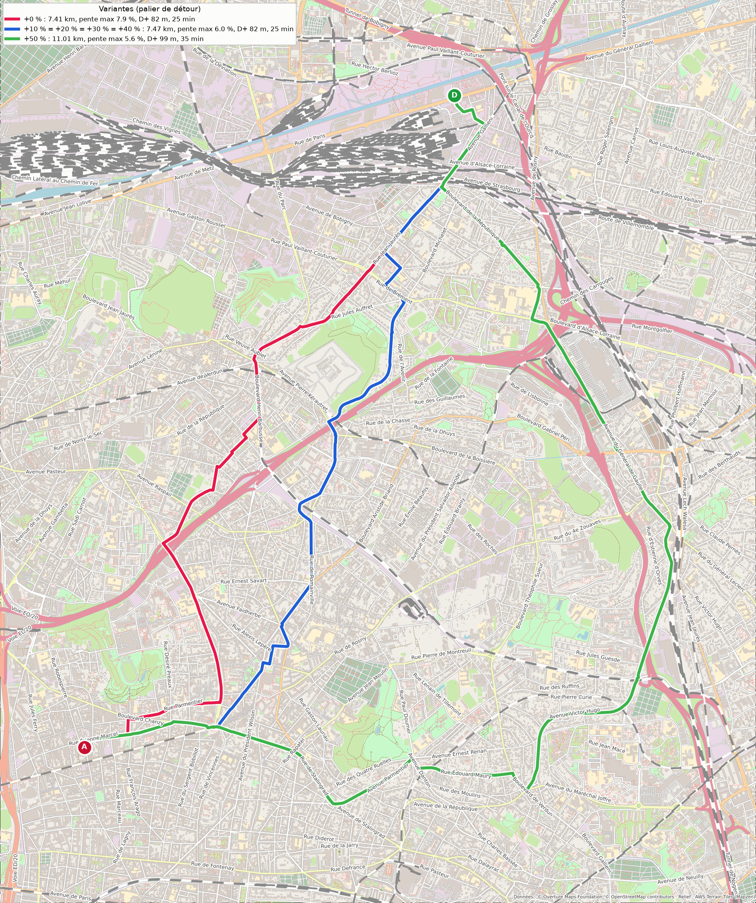
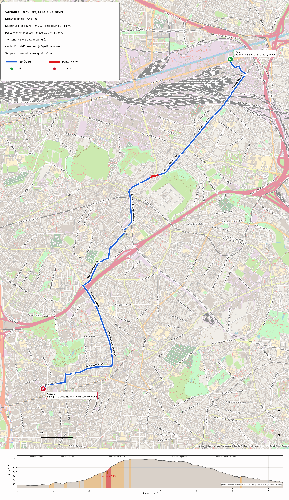
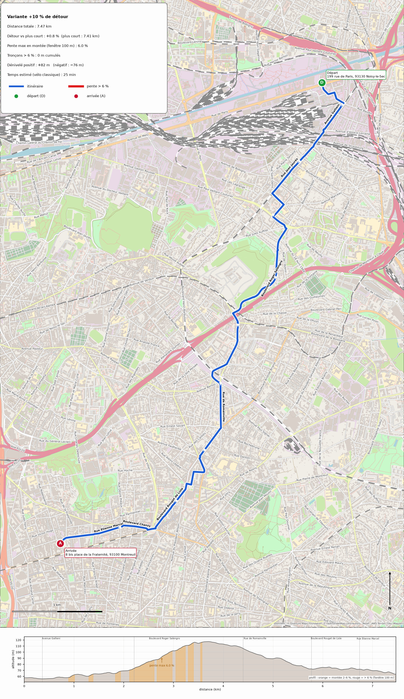
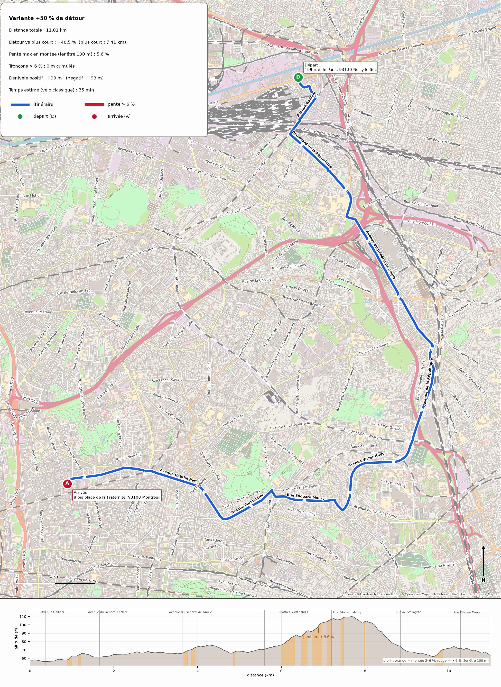

# Itinéraires vélo à pente douce

**Départ :** 199 rue de Paris, 93130 Noisy-le-Sec (48.9025, 2.4621)  
**Arrivée :** 8 bis place de la Fraternité, 93100 Montreuil (48.8567, 2.4225)  
**Mode :** vélo classique · **Paliers :** +0 %, +10 %, +20 %, +30 %, +40 %, +50 % · **Pente max mesurée sur fenêtre de 100 m** · **Seuil « raide » : 6 %**

## Tableau récapitulatif

| Palier | Distance | Détour réel | Pente max montée (100 m) | Longueur > 6 % | D+ | D− | Temps estimé | Tracé |
|---|---|---|---|---|---|---|---|---|
| +0 % | 7.41 km | +0.0 % | **7.9 %** | 131 m | +82 m | −76 m | 25 min | [carte](variante_+00pct.png) |
| +10 % | 7.47 km | +0.8 % | **6.0 %** | 0 m | +82 m | −76 m | 25 min | [carte](variante_+10pct.png) |
| +20 % | 7.47 km | +0.8 % | **6.0 %** | 0 m | +82 m | −76 m | 25 min | identique au palier +10 % |
| +30 % | 7.47 km | +0.8 % | **6.0 %** | 0 m | +82 m | −76 m | 25 min | identique au palier +10 % |
| +40 % | 7.47 km | +0.8 % | **6.0 %** | 0 m | +82 m | −76 m | 25 min | identique au palier +10 % |
| +50 % | 11.01 km | +48.5 % | **5.6 %** | 0 m | +99 m | −93 m | 35 min | [carte](variante_+50pct.png) |

Pour chaque palier, l'itinéraire retenu est celui dont la pente maximale en montée (fenêtre glissante de 100 m) est la plus faible parmi les tracés dont la longueur reste dans le budget du palier ; à pente max égale, on privilégie le tracé qui minimise les tronçons > 6 % puis les mètres proches de la pente max.

## Palier +0 % (trajet le plus court)

- Distance : **7.41 km** (détour +0.0 % par rapport au plus court, 7.41 km)
- Pente max en montée (fenêtre 100 m) : **7.9 %**
- Tronçons > 6 % : **131 m** cumulés
- Dénivelé : **+82 m** / −76 m
- Temps estimé : **25 min**
- Fichiers : [variante_+00pct.png](variante_+00pct.png) · [GPX](variante_+00pct.gpx) · [GeoJSON](variante_+00pct.geojson)

### Feuille de route

Départ : 199 rue de Paris, 93130 Noisy-le-Sec
 1. Partir sur **Rue René Clément** — 196 m
 2. Tourner à droite sur **Rue Jean Gabin** — 129 m
 3. Continuer tout droit sur **Rue Emmanuel Arago** — 36 m
 4. Tourner à droite sur **Avenue Gallieni** — 357 m
 5. Continuer tout droit sur **voie sans nom** — 31 m
 6. Continuer tout droit sur **Avenue Gallieni** — 211 m  
    ⛰ montée sur 69 m (+3 m), pente max 4.2 %
 7. Légèrement à droite sur **Place Jean Coquelin** — 9 m
 8. Continuer tout droit sur **Rue Jean Jaurès** — 868 m  
    ⛰ montée sur 186 m (+11 m), pente max 4.2 % ; descente sur 59 m (pente min -2.4 %)
 9. Continuer tout droit sur **Rue Anatole France** — 724 m  
    ⛰ montée sur 639 m (+30 m), pente max 7.9 %, dont 89 m à plus de 6 %
10. Légèrement à gauche sur **Rue du Parc** — 42 m  
    ⛰ montée sur 42 m (+1 m), pente max 7.1 %, dont 42 m à plus de 6 %
11. Continuer tout droit sur **Rue Anatole France** — 368 m  
    ⛰ montée sur 368 m (+17 m), pente max 6.0 %, dont 9 m à plus de 6 %
12. Légèrement à gauche sur **Rue Veuve Aublet** — 66 m
13. Continuer tout droit sur **Boulevard Henri Barbusse** — 449 m  
    ⛰ montée sur 59 m (+3 m), pente max 2.4 %
14. Légèrement à droite sur **Rue Irène Joliot-Curie** — 176 m
15. Tourner à gauche sur **Rue de Benfleet** — 37 m
16. Tourner à droite sur **voie de service** — 159 m
17. Tourner à gauche sur **Rue Pierre Curie** — 12 m
18. Tourner à droite sur **Rue Eugène Levasseur** — 151 m  
    ↘ descente sur 68 m (pente min -2.9 %)
19. Tourner à droite sur **Rue Anatole France** — 19 m
20. Tourner à gauche sur **Rue d'Alembert** — 189 m
21. Tourner à droite sur **Rue des Rigondes** — 602 m  
    ↘ descente sur 149 m (pente min -4.4 %)
22. Tourner à gauche sur **Pont Pasteur** — 88 m  
    ↘ descente sur 69 m (pente min -4.1 %)
23. Continuer tout droit sur **Avenue Pasteur** — 386 m  
    ↘ descente sur 152 m (pente min -3.3 %)
24. Continuer tout droit sur **Rue de Villiers** — 152 m
25. Continuer tout droit sur **Avenue de la Résistance** — 722 m  
    ↘ descente sur 482 m (pente min -4.8 %)
26. Tourner à droite sur **Rue Parmentier** — 546 m  
    ↘ descente sur 98 m (pente min -3.2 %)
27. Continuer tout droit sur **Rue des Sorins** — 125 m  
    ↘ descente sur 79 m (pente min -3.2 %)
28. Légèrement à droite sur **Boulevard Chanzy** — 77 m
29. Tourner à gauche sur **Rue du Centenaire** — 127 m
30. Tourner à droite sur **piste cyclable** — 300 m  
    ↘ descente sur 101 m (pente min -3.2 %)
31. Continuer tout droit sur **Place de la Fraternité** — 54 m  
    ↘ descente sur 54 m (pente min -2.9 %)
32. Tourner à droite sur **Rue Arsène Chéreau** — 6 m
33. Arrivée : 8 bis place de la Fraternité, 93100 Montreuil — total 7.4 km, 25 min, D+ 82 m

## Palier +10 % de détour

- Distance : **7.47 km** (détour +0.8 % par rapport au plus court, 7.41 km)
- Pente max en montée (fenêtre 100 m) : **6.0 %**
- Tronçons > 6 % : **0 m** cumulés
- Dénivelé : **+82 m** / −76 m
- Temps estimé : **25 min**
- Fichiers : [variante_+10pct.png](variante_+10pct.png) · [GPX](variante_+10pct.gpx) · [GeoJSON](variante_+10pct.geojson)

### Feuille de route

Départ : 199 rue de Paris, 93130 Noisy-le-Sec
 1. Partir sur **Rue René Clément** — 196 m
 2. Tourner à droite sur **Rue Jean Gabin** — 129 m
 3. Continuer tout droit sur **Rue Emmanuel Arago** — 36 m
 4. Tourner à droite sur **Avenue Gallieni** — 357 m
 5. Continuer tout droit sur **voie sans nom** — 31 m
 6. Continuer tout droit sur **Avenue Gallieni** — 211 m  
    ⛰ montée sur 69 m (+3 m), pente max 4.2 %
 7. Légèrement à droite sur **Place Jean Coquelin** — 9 m
 8. Continuer tout droit sur **Rue Jean Jaurès** — 678 m  
    ⛰ montée sur 148 m (+8 m), pente max 4.2 % ; descente sur 59 m (pente min -2.4 %)
 9. Tourner à gauche sur **Rue Adrien Damoiselet** — 178 m
10. Tourner à droite sur **Rue Pierre Brossolette** — 183 m  
    ⛰ montée sur 113 m (+4 m), pente max 3.6 %
11. Tourner à gauche sur **Rue de Brément** — 151 m  
    ⛰ montée sur 44 m (+2 m), pente max 3.1 %
12. Légèrement à droite sur **Place du Général de Gaulle** — 48 m  
    ⛰ montée sur 48 m (+2 m), pente max 4.0 %
13. Tourner à droite sur **Boulevard Roger Salengro** — 1.2 km  
    ⛰ montée sur 1.0 km (+43 m), pente max 6.0 %
14. Tourner à gauche sur **Avenue Pierre Kérautret** — 109 m
15. Continuer tout droit sur **Place Salvador Allende** — 19 m
16. Légèrement à droite sur **Route de Montreuil** — 185 m
17. Continuer tout droit sur **Route de Montreuil / Rue de Romainville** — 294 m  
    ↘ descente sur 52 m (pente min -2.2 %)
18. Légèrement à droite sur **Rue du Docteur Calmette** — 238 m
19. Légèrement à gauche sur **Rue Albert Thomas** — 66 m  
    ↘ descente sur 55 m (pente min -3.0 %)
20. Continuer tout droit sur **rue sans nom** — 57 m  
    ↘ descente sur 57 m (pente min -4.0 %)
21. Légèrement à droite sur **Rue de Romainville** — 482 m  
    ↘ descente sur 482 m (pente min -4.7 %)
22. Légèrement à droite sur **Boulevard Paul Vaillant-Couturier** — 386 m  
    ↘ descente sur 135 m (pente min -4.5 %)
23. Légèrement à gauche sur **Place François Mitterrand** — 29 m
24. Légèrement à gauche sur **Rue Franklin** — 164 m  
    ↘ descente sur 151 m (pente min -4.2 %)
25. Tourner à droite sur **Rue de l'Église** — 115 m
26. Tourner à gauche sur **Rue de la Convention** — 145 m  
    ↘ descente sur 139 m (pente min -3.8 %)
27. Tourner à droite sur **Avenue Walwein** — 52 m
28. Tourner à gauche sur **Boulevard Rouget de Lisle** — 599 m  
    ↘ descente sur 58 m (pente min -2.5 %)
29. Tourner à droite sur **piste cyclable** — 36 m
30. Continuer tout droit sur **Place Jacques Duclos** — 56 m
31. Légèrement à droite sur **Boulevard Chanzy** — 279 m
32. Légèrement à gauche sur **Rue Étienne Marcel** — 337 m
33. Continuer tout droit sur **piste cyclable** — 335 m  
    ↘ descente sur 119 m (pente min -3.2 %)
34. Continuer tout droit sur **Place de la Fraternité** — 54 m  
    ↘ descente sur 54 m (pente min -2.9 %)
35. Tourner à droite sur **Rue Arsène Chéreau** — 6 m
36. Arrivée : 8 bis place de la Fraternité, 93100 Montreuil — total 7.5 km, 25 min, D+ 82 m

## Palier +20 % de détour

Le tracé optimal de ce palier est **identique à celui du palier +10 %** (7.47 km, pente max 6.0 %) : le budget de distance supplémentaire ne permet pas de trouver un tracé à pente maximale plus faible. Pas d'image dupliquée.

## Palier +30 % de détour

Le tracé optimal de ce palier est **identique à celui du palier +10 %** (7.47 km, pente max 6.0 %) : le budget de distance supplémentaire ne permet pas de trouver un tracé à pente maximale plus faible. Pas d'image dupliquée.

## Palier +40 % de détour

Le tracé optimal de ce palier est **identique à celui du palier +10 %** (7.47 km, pente max 6.0 %) : le budget de distance supplémentaire ne permet pas de trouver un tracé à pente maximale plus faible. Pas d'image dupliquée.

## Palier +50 % de détour

- Distance : **11.01 km** (détour +48.5 % par rapport au plus court, 7.41 km)
- Pente max en montée (fenêtre 100 m) : **5.6 %**
- Tronçons > 6 % : **0 m** cumulés
- Dénivelé : **+99 m** / −93 m
- Temps estimé : **35 min**
- Fichiers : [variante_+50pct.png](variante_+50pct.png) · [GPX](variante_+50pct.gpx) · [GeoJSON](variante_+50pct.geojson)

### Feuille de route

Départ : 199 rue de Paris, 93130 Noisy-le-Sec
 1. Partir sur **Rue René Clément** — 196 m
 2. Tourner à droite sur **Rue Jean Gabin** — 129 m
 3. Continuer tout droit sur **Rue Emmanuel Arago** — 36 m
 4. Tourner à droite sur **Avenue Gallieni** — 357 m
 5. Continuer tout droit sur **voie sans nom** — 31 m
 6. Continuer tout droit sur **Avenue Gallieni** — 211 m  
    ⛰ montée sur 69 m (+3 m), pente max 4.3 %
 7. Légèrement à droite sur **Place Jean Coquelin** — 9 m
 8. Tourner à gauche sur **Boulevard de la République** — 648 m  
    ⛰ montée sur 107 m (+5 m), pente max 4.0 % ; descente sur 65 m (pente min -2.5 %)
 9. Continuer tout droit sur **Rond-Point du 11 Novembre 1918** — 36 m
10. Continuer tout droit sur **Avenue du Général Leclerc** — 407 m
11. Légèrement à droite sur **voie sans nom** — 42 m
12. Légèrement à droite sur **Rue de Montreuil à Claye** — 245 m
13. Tourner à gauche sur **Rue de Brément** — 116 m
14. Légèrement à droite sur **Avenue du Général de Gaulle** — 1.1 km
15. Continuer tout droit sur **Rue de Metz** — 105 m
16. Continuer tout droit sur **Avenue du Général de Gaulle** — 400 m  
    ⛰ montée sur 202 m (+8 m), pente max 2.7 %
17. Continuer tout droit sur **Rue du Général Gallieni** — 283 m
18. Continuer tout droit sur **Place Émile Lécrivain** — 17 m
19. Légèrement à droite sur **Avenue de la République** — 966 m  
    ⛰ montée sur 41 m (+4 m), pente max 2.1 % ; descente sur 291 m (pente min -2.8 %)
20. Continuer tout droit sur **Avenue Victor Hugo / Avenue de la République** — 270 m
21. Légèrement à droite sur **voie sans nom** — 27 m
22. Continuer tout droit sur **Avenue Victor Hugo** — 1.4 km  
    ⛰ montée sur 680 m (+35 m), pente max 5.6 %
23. Continuer tout droit sur **Place du 8 Mai 1945** — 20 m
24. Tourner à droite sur **Boulevard de Verdun** — 169 m  
    ⛰ montée sur 107 m (+3 m), pente max 2.7 %
25. Tourner à gauche sur **Rue Édouard Maury** — 750 m  
    ⛰ montée sur 82 m (+5 m), pente max 2.5 % ; descente sur 197 m (pente min -3.9 %)
26. Tourner à droite sur **Avenue Danton** — 93 m
27. Tourner à gauche sur **Avenue Parmentier** — 729 m  
    ↘ descente sur 642 m (pente min -6.5 %)
28. Légèrement à droite sur **Avenue de Stalingrad** — 71 m  
    ↘ descente sur 71 m (pente min -3.4 %)
29. Continuer tout droit sur **Rue de Stalingrad** — 399 m  
    ↘ descente sur 167 m (pente min -4.1 %)
30. Continuer tout droit sur **Avenue Gabriel Péri** — 659 m  
    ⛰ montée sur 188 m (+9 m), pente max 5.3 %
31. Continuer tout droit sur **Place Jacques Duclos** — 99 m
32. Légèrement à droite sur **Boulevard Chanzy** — 279 m
33. Légèrement à gauche sur **Rue Étienne Marcel** — 337 m
34. Continuer tout droit sur **piste cyclable** — 335 m  
    ↘ descente sur 119 m (pente min -3.2 %)
35. Continuer tout droit sur **Place de la Fraternité** — 54 m  
    ↘ descente sur 54 m (pente min -2.9 %)
36. Tourner à droite sur **Rue Arsène Chéreau** — 6 m
37. Arrivée : 8 bis place de la Fraternité, 93100 Montreuil — total 11.0 km, 35 min, D+ 99 m

## Sources et méthode
- **Réseau viaire** : Overture Maps (thème `transportation`, dérivé d'OpenStreetMap), lecture directe des fichiers
  Parquet publics sur S3 pour l'emprise du calcul ; noms de rues, classes de voies, sens uniques et restrictions
  d'accès (voies privées, interdictions vélo) sont pris en compte. Les trottoirs et passages piétons sont exclus ;
  les chemins piétons ne sont utilisés que s'ils autorisent explicitement les vélos.
- **Relief** : tuiles d'altitude Terrarium (AWS Terrain Tiles / Mapzen, zoom 14, ≈ 6 m par pixel, données
  SRTM/EU-DEM ~25–30 m). Altitude échantillonnée tous les 10 m le long des voies, lissée sur 30 m ; sous les ponts
  et dans les tunnels l'altitude est interpolée entre les extrémités.
- **Moteur de routage** : moteur maison sensible au relief (les moteurs publics BRouter / OpenRouteService /
  GraphHopper ne sont pas joignables depuis l'environnement d'exécution). Pour chaque palier, recherche
  dichotomique de la plus petite pente max admissible : plus court chemin (Dijkstra) sur le sous-graphe des
  arcs dont la pente effective ≤ seuil, vérification de la pente fenêtrée sur le tracé complet, puis relèvement de
  la pente effective des arcs responsables et nouvel essai (contraintes paresseuses) jusqu'à conformité.
- **Temps estimé** : modèle de puissance (110 W soutenus, 90 kg cycliste + vélo, Crr 0,007, SCx 0,55, 32 km/h max
  en descente, marche à 3,5 km/h sous cette vitesse) + 8 s par changement de rue.
- **Limites** : la précision du MNT (~1 m d'altitude, résolution 25–30 m) rend incertaines les pentes sur des
  tronçons très courts ; les doubles-sens cyclables ne sont pas encodés dans Overture, les sens uniques sont donc
  respectés comme pour une voiture.
